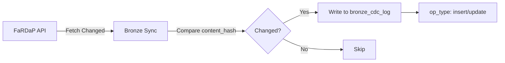
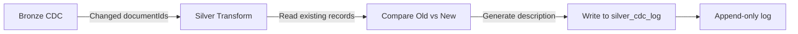

# Change Data Capture (CDC) Guide

> Comprehensive guide to understanding and using CDC logs in the FaRDaP Analytical Platform

---

## Table of Contents

- [Overview](#overview)
- [How CDC Works](#how-cdc-works)
- [CDC Description Modes](#cdc-description-modes)
- [Configuration](#configuration)
- [Understanding CDC Scope](#understanding-cdc-scope)
- [Querying CDC Data](#querying-cdc-data)
- [Use Cases](#use-cases)
- [Performance Considerations](#performance-considerations)
- [Limitations](#limitations)
- [Troubleshooting](#troubleshooting)

---

## Overview

The **Change Data Capture (CDC)** system provides a complete audit trail of all data changes in the Silver layer. Every time a record is inserted or updated, the CDC log captures:

- **What changed**: The specific fields that were modified
- **When it changed**: Precise timestamp of the change
- **Operation type**: INSERT or UPDATE
- **Change description**: Human-readable summary of modifications

### CDC Tables

| Table | Layer | Purpose |
|:------|:------|:--------|
| `fardap_bronze_cdc_log` | Bronze | Tracks API document changes (insert/update) |
| `fardap_silver_cdc_log` | Silver | **Detailed change descriptions with field-level tracking** |

---

## How CDC Works

### Bronze Layer CDC

The Bronze CDC log tracks which documents changed at the API level:



**Bronze CDC Schema:**
```sql
CREATE TABLE fardap_bronze_cdc_log (
    documentId STRING,
    op_type STRING,           -- 'insert' or 'update'
    change_ts STRING,         -- API dateUpdated
    sync_timestamp TIMESTAMP  -- When record was captured
)
```

### Silver Layer CDC (Enhanced)

The Silver CDC log provides **detailed change descriptions** by comparing old and new record values:



**Silver CDC Schema:**
```sql
CREATE TABLE fardap_silver_cdc_log (
    documentId INT64,
    op_type STRING,               -- 'insert' or 'update'
    flattened_at TIMESTAMP,       -- When transform occurred
    cdc_timestamp TIMESTAMP,      -- CDC record timestamp
    change_description STRING     -- **Detailed change summary**
)
```

---

## CDC Description Modes

Configure the level of detail in change descriptions via the `CDC_DESCRIPTION_MODE` variable.

### Mode Comparison

| Mode | Description | Storage Size | Performance | Use Case |
|:-----|:------------|:-------------|:------------|:---------|
| **Compact** | Field names only | Small (~100-200 chars) | Fastest (2-3% overhead) | Quick field-level auditing |
| **Detailed** | First 5 fields with old→new values | Medium (~500-1000 chars) | Fast (3-5% overhead) | Human-readable change summaries |
| **Complete** | Full JSON of all changes | Large (~2-10 KB per update) | Slightly slower (5-8% overhead) | Full audit trail, compliance |

### Example Outputs

#### Compact Mode
```
5 fields changed: content_status, content_priority, content_location, content_severity, content_assignedto
```

#### Detailed Mode (Recommended)
```
content_status: 'Open' → 'Closed'; content_priority: 'High' → 'Medium'; content_dateresolved: 'null' → '2026-06-11T14:30:00Z'; +2 other fields
```

#### Complete Mode
```json
{
  "content_status": {"old": "Open", "new": "Closed"},
  "content_priority": {"old": "High", "new": "Medium"},
  "content_dateresolved": {"old": null, "new": "2026-06-11T14:30:00Z"},
  "content_assignedto": {"old": "John Smith", "new": "Jane Doe"},
  "content_location": {"old": "Station A", "new": "Station B"}
}
```

### For INSERT Operations

All modes generate a count of populated fields:

```
New record with 87 populated fields
```

---

## Configuration

### Variable Library Setup

Add to `var_library_fardap.VariableLibrary/variables.json`:

```json
{
  "name": "CDC_DESCRIPTION_MODE",
  "type": "String",
  "value": "Detailed",
  "note": "Change description format: Compact, Detailed, or Complete"
}
```

### Environment-Specific Overrides

You can override CDC mode per environment in `valueSets/dev.json` or `valueSets/prod.json`:

```json
{
  "name": "dev",
  "variableOverrides": [
    {
      "name": "CDC_DESCRIPTION_MODE",
      "value": "Detailed"
    }
  ]
}
```

```json
{
  "name": "prod",
  "variableOverrides": [
    {
      "name": "CDC_DESCRIPTION_MODE",
      "value": "Complete"
    }
  ]
}
```

### Changing Modes

1. Update the variable in Variable Library
2. No code changes needed - next pipeline run uses new mode
3. Existing CDC records remain in their original format
4. New records use the new mode

---

## Understanding CDC Scope

### ⚠️ Important Limitations

#### CDC Tracks Changes AFTER Initial Load Only

The CDC log is **prospective**, not retrospective:

✅ **What CDC Does:**
- Tracks all changes from the moment incremental pipelines start running
- Captures every update after initial full load completes
- Provides ongoing audit trail for operational monitoring

❌ **What CDC Does NOT Do:**
- Cannot show historical changes before the platform was deployed
- Cannot reconstruct change history if Silver layer is rebuilt
- Does not retroactively track changes from API history

#### Rebuild Scenario

If you need to rebuild the Silver layer (e.g., schema changes, data corruption):

1. **Run Full Transform** (`02_Silver_Full_Transform_Enhanced`)
2. **Result**: All records in CDC log show as `INSERT` operations
3. **Lost Data**: Previous change history is cleared
4. **Going Forward**: Incremental updates resume tracking changes

**Example Timeline:**

```
Day 1: Initial full load
  └─ CDC: 10,000 INSERTs

Day 2-30: Incremental updates  
  └─ CDC: 500 UPDATEs with detailed change tracking

Day 31: Rebuild Silver layer (schema change)
  └─ CDC: Old history cleared, 10,000 new INSERTs

Day 32+: Incremental updates resume
  └─ CDC: New change tracking from this point forward
```

#### Best Practices for CDC Preservation

| Practice | Purpose |
|:---------|:--------|
| **Archive CDC before rebuilds** | Export `fardap_silver_cdc_log` to separate table |
| **Minimize full transforms** | Only rebuild when absolutely necessary |
| **Use schema evolution** | Prefer adding columns over rebuilding |
| **Document rebuild reasons** | Maintain operations log of rebuild events |

### CDC Archive Example

Before rebuilding Silver:

```python
# Archive existing CDC log
spark.sql("""
    CREATE TABLE fardap_silver_cdc_log_archive AS
    SELECT *, current_timestamp() as archived_at
    FROM fardap_silver_cdc_log
""")

# Now safe to rebuild Silver layer
# Run 02_Silver_Full_Transform_Enhanced
```

---

## Querying CDC Data

### Recent Changes

```sql
-- Last 24 hours of changes
SELECT 
    documentId,
    op_type,
    change_description,
    cdc_timestamp
FROM fardap_silver_cdc_log
WHERE cdc_timestamp >= CURRENT_TIMESTAMP() - INTERVAL 1 DAY
ORDER BY cdc_timestamp DESC
```

### Changes by Document

```sql
-- Change history for specific incident
SELECT 
    documentId,
    op_type,
    change_description,
    cdc_timestamp
FROM fardap_silver_cdc_log
WHERE documentId = '12345678'
ORDER BY cdc_timestamp ASC
```

### Update Statistics

```sql
-- Count of operations by type
SELECT 
    op_type,
    COUNT(*) as change_count,
    MIN(cdc_timestamp) as first_change,
    MAX(cdc_timestamp) as last_change
FROM fardap_silver_cdc_log
GROUP BY op_type
ORDER BY change_count DESC
```

### Most Frequently Updated Records

```sql
-- Top 10 most-changed documents
SELECT 
    documentId,
    COUNT(*) as update_count,
    MAX(cdc_timestamp) as last_updated
FROM fardap_silver_cdc_log
WHERE op_type = 'update'
GROUP BY documentId
ORDER BY update_count DESC
LIMIT 10
```

### Field-Level Change Analysis (Detailed/Complete Modes)

```sql
-- Find records where status changed
SELECT 
    documentId,
    change_description,
    cdc_timestamp
FROM fardap_silver_cdc_log
WHERE change_description LIKE '%content_status%'
    AND op_type = 'update'
ORDER BY cdc_timestamp DESC
```

### Complete Mode JSON Parsing

```python
from pyspark.sql.functions import get_json_object

# Parse Complete mode JSON
df_changes = spark.table("fardap_silver_cdc_log").filter(
    col("op_type") == "update"
)

# Extract specific field changes
df_status_changes = df_changes.withColumn(
    "old_status",
    get_json_object(col("change_description"), "$.content_status.old")
).withColumn(
    "new_status", 
    get_json_object(col("change_description"), "$.content_status.new")
).filter(
    col("old_status").isNotNull()
)

df_status_changes.select(
    "documentId", "old_status", "new_status", "cdc_timestamp"
).show()
```

---

## Use Cases

### 1. Operational Monitoring

**Track data freshness and update patterns:**

```sql
-- Updates by hour
SELECT 
    DATE_TRUNC('hour', cdc_timestamp) as hour,
    COUNT(*) as changes
FROM fardap_silver_cdc_log
WHERE cdc_timestamp >= CURRENT_TIMESTAMP() - INTERVAL 7 DAY
GROUP BY hour
ORDER BY hour DESC
```

### 2. Data Quality Auditing

**Identify suspicious patterns:**

```sql
-- Records updated multiple times in short period
SELECT 
    documentId,
    COUNT(*) as update_count,
    MIN(cdc_timestamp) as first_update,
    MAX(cdc_timestamp) as last_update,
    TIMESTAMPDIFF(MINUTE, MIN(cdc_timestamp), MAX(cdc_timestamp)) as minutes_between
FROM fardap_silver_cdc_log
WHERE cdc_timestamp >= CURRENT_TIMESTAMP() - INTERVAL 1 DAY
    AND op_type = 'update'
GROUP BY documentId
HAVING update_count > 5 AND minutes_between < 60
ORDER BY update_count DESC
```

### 3. Compliance Reporting

**Complete audit trail for specific incidents:**

```python
# Generate audit report
def generate_audit_report(document_id):
    df_audit = spark.sql(f"""
        SELECT 
            documentId,
            op_type,
            change_description,
            cdc_timestamp
        FROM fardap_silver_cdc_log
        WHERE documentId = '{document_id}'
        ORDER BY cdc_timestamp ASC
    """)
    
    return df_audit.toPandas()

# Export to Excel for compliance
report = generate_audit_report("12345678")
report.to_excel(f"audit_trail_12345678.xlsx", index=False)
```

### 4. Data Lineage Tracking

**Understand when and why data changed:**

```sql
-- Changes by time period
SELECT 
    DATE(cdc_timestamp) as change_date,
    op_type,
    COUNT(*) as count
FROM fardap_silver_cdc_log
GROUP BY change_date, op_type
ORDER BY change_date DESC, op_type
```

---

## Performance Considerations

### Storage Requirements

| Mode | Per UPDATE Record | 1M Updates/Year |
|:-----|:------------------|:----------------|
| Compact | ~150 bytes | ~150 MB |
| Detailed | ~750 bytes | ~750 MB |
| Complete | ~5 KB | ~5 GB |

### Processing Overhead

The CDC system adds minimal overhead because:

✅ **Optimized Operations:**
- Only reads existing records for UPDATEs (not INSERTs)
- Filtered reads (only changed documentIds)
- Compares only `content_*` fields (not all 100+ columns)
- Column-level comparisons are in-memory operations
- Append-only writes (no MERGE overhead)

❌ **Avoid These:**
- Querying CDC log with broad time ranges without filters
- Parsing Complete mode JSON in every query
- Joining CDC log with main tables unnecessarily

### Delta Lake Optimization

```python
# Optimize CDC log monthly
spark.sql("OPTIMIZE fardap_silver_cdc_log")

# Z-order by documentId and cdc_timestamp for fast lookups
spark.sql("""
    OPTIMIZE fardap_silver_cdc_log
    ZORDER BY (documentId, cdc_timestamp)
""")
```

### Partitioning Strategy (Future)

For high-volume deployments:

```python
# Partition CDC by date (recommended after 10M+ records)
df_cdc.write.format("delta") \
    .mode("append") \
    .partitionBy("cdc_date") \
    .saveAsTable("fardap_silver_cdc_log")
```

---

## Limitations

### 1. **No Retroactive History**
- CDC only tracks changes from initial deployment forward
- Rebuilding Silver layer clears CDC history

### 2. **Field-Level Comparison Scope**
- Only compares `content_*` fields and key metadata
- Does not track changes in `raw_json` column
- Array table changes not tracked in Silver CDC

### 3. **Description Truncation**
- Detailed mode shows first 5 changed fields only
- Old/new values truncated to 50 characters
- Use Complete mode for full change details

### 4. **Storage Growth**
- High-update workloads generate large CDC logs
- Complete mode can use significant storage
- Consider archival strategy for older data

### 5. **Bronze-Silver CDC Gap**
- Bronze CDC shows API-level changes
- Silver CDC only generated if content_hash differs
- Metadata-only changes may appear in Bronze but not Silver CDC

---

## Troubleshooting

### CDC Log Empty After Incremental Run

**Possible Causes:**
1. No actual changes in Bronze since last run
2. Changes detected but content_hash unchanged (expected)
3. Incremental pipeline failed before CDC step

**Diagnosis:**
```sql
-- Check Bronze CDC log
SELECT COUNT(*) FROM fardap_bronze_cdc_log;

-- Check Silver content hash comparisons
SELECT 
    COUNT(*) as bronze_changes,
    SUM(CASE WHEN content_hash_changed THEN 1 ELSE 0 END) as silver_changes
FROM (
    SELECT b.documentId,
           b.content_hash != s.content_hash as content_hash_changed
    FROM fardap_bronze_incidents b
    LEFT JOIN fardap_silver_content_hash s ON b.documentId = s.documentId
)
```

### Change Descriptions Show "Unknown Operation"

**Cause:** Record in Bronze CDC but not properly processed

**Solution:** Re-run incremental transform

### Performance Degraded After Enabling Complete Mode

**Solutions:**
1. Switch to Detailed mode (3-5% overhead vs 5-8%)
2. Optimize CDC log with Z-ordering
3. Archive old CDC records
4. Reduce comparison field count

### CDC Timestamp Doesn't Match Bronze Sync

**Expected Behavior:**
- `bronze.sync_timestamp` = when Bronze fetched from API
- `silver.flattened_at` = when Silver transform ran
- `silver.cdc_timestamp` = when CDC record written

These can differ by seconds/minutes based on pipeline execution.

---

## Best Practices

### ✅ Do

- Use **Detailed mode** for most deployments (good balance)
- Archive CDC logs before rebuilding Silver layer
- Optimize CDC table monthly with Z-ordering
- Query CDC with `documentId` filters when possible
- Monitor CDC log growth and plan archival strategy

### ❌ Don't

- Query CDC without time/document filters on large datasets
- Rebuild Silver layer without archiving CDC first
- Use Complete mode unless compliance requires it
- Parse Complete JSON in every query
- Expect CDC to show pre-deployment history

---

## Related Documentation

- [Configuration Guide](CONFIGURATION.md) - Variable library setup
- [Data Pipelines Guide](DATA_PIPELINES.md) - Pipeline execution
- [Table Reference](TABLE_REFERENCE.md) - CDC table schemas
- [Technical Documentation](TECHNICAL_DOCUMENTATION.md) - Architecture details

---

## Summary

The CDC system provides powerful change tracking with configurable detail levels:

| Aspect | Details |
|:-------|:--------|
| **Modes** | Compact, Detailed, Complete |
| **Overhead** | 2-8% depending on mode |
| **Scope** | Post-deployment changes only |
| **Storage** | 150 MB - 5 GB per million updates |
| **Use Cases** | Auditing, compliance, monitoring, debugging |

**Key Takeaway**: CDC tracks changes from deployment forward. Archive CDC logs before rebuilding Silver layer to preserve history.

---

<p align="center">
  <sub>Last Updated: 2026-06-11</sub>
</p>
