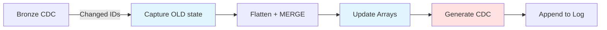
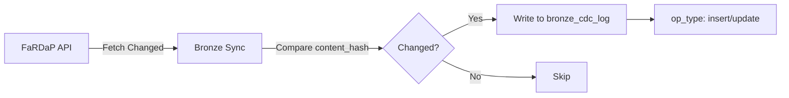
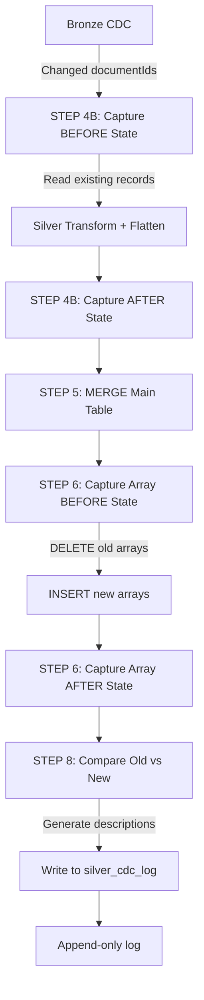

# Change Data Capture (CDC) Guide

> Comprehensive guide to understanding and using CDC logs in the FaRDaP Analytical Fabric Ingestion Platform

---

## Table of Contents

- [Overview](#overview)
- [Quick Reference: Notebook Workflow](#quick-reference-notebook-workflow)
- [How CDC Works](#how-cdc-works)
- [CDC Description Modes](#cdc-description-modes)
- [Array Change Tracking](#array-change-tracking)
- [Configuration](#configuration)
- [Understanding CDC Scope](#understanding-cdc-scope)
- [Querying CDC Data](#querying-cdc-data)
- [Use Cases](#use-cases)
- [Performance Considerations](#performance-considerations)
- [Limitations](#limitations)
- [Troubleshooting](#troubleshooting)
- [Best Practices](#best-practices)

---

## Quick Reference: Notebook Workflow

**Notebook**: `02_Silver_Incremental_Transform_Enhanced.Notebook`

The CDC tracking happens automatically during the Silver incremental transform:



### Step-by-Step Process

| Step | Action | Purpose |
|:-----|:-------|:--------|
| **STEP 4B** | Capture BEFORE state | Read existing Silver records before changes |
| **STEP 5** | Transform + MERGE main table | Flatten JSON, compare hashes, MERGE updates |
| **STEP 6** | Update array tables | DELETE old arrays, INSERT new arrays, track before/after |
| **STEP 8** | Generate CDC descriptions | Compare old vs new, format per CDC_DESCRIPTION_MODE |
| **STEP 9** | Update watermark | Record max sync_timestamp for next run |

### What Gets Captured

```python
# For each changed documentId:
{
    "documentId": "12345678",
    "op_type": "update",  # or "insert"
    "old_records": {...},  # Main table fields (STEP 4B)
    "new_records": {...},  # Main table fields (STEP 5)
    "array_changes": {
        "casualties": {
            "old_count": 2,
            "new_count": 3,
            "old_records": [...],  # Full array records (STEP 6)
            "new_records": [...]   # Full array records (STEP 6)
        }
    }
}
```

**Key Insight**: The notebook captures state at multiple points (before/after main table, before/after arrays) to build a complete change picture.

### Console Output During CDC Generation

When the notebook runs, you'll see diagnostic output:

```
[INFO] Generating change descriptions (Mode: Complete)...
  Using before-state captured in STEP 4B (INSERTs: 5, UPDATEs: 12)
  OLD records available: 12
  NEW records available: 17

[ARRAY CDC TRACKING] Summary of array changes (full records captured):
  12345678: casualties: 2→3, injuries: 1→0
  12345679: rescues: 0→1, vehicles: 2→2
  12345680: casualties: 1→1, injuries: 0→2
  Total array tables with changes: 6
  (Complete records stored for CDC mode: Complete)

[INFO] Appended 17 records to fardap_silver_cdc_log
[INFO] Change descriptions generated: 17

📊 Silver CDC op_type distribution (last 100 records):
  insert: 5
  update: 12
```

This confirms that array changes are being tracked successfully.

---

## Overview

The **Change Data Capture (CDC)** system provides a complete audit trail of all data changes in the Silver layer. Every time a record is inserted or updated, the CDC log captures:

- **What changed**: The specific fields that were modified (main table + array tables)
- **When it changed**: Precise timestamp of the change
- **Operation type**: INSERT or UPDATE
- **Change description**: Human-readable summary of modifications
- **Array changes**: Full before/after records for array tables (casualties, injuries, rescues, etc.)

### CDC Tables

| Table | Layer | Purpose |
|:------|:------|:--------|
| `fardap_bronze_cdc_log` | Bronze | Tracks API document changes (insert/update) |
| `fardap_silver_cdc_log` | Silver | **Detailed change descriptions with field-level AND array-level tracking** |

### What Gets Tracked

✅ **Main Table Changes:**
- All `content_*` fields (incident details, location, severity, etc.)
- Metadata fields (`content_hash`, `dateUpdated`)
- Side-by-side old vs new values

✅ **Array Table Changes (NEW):**
- Full records from array tables (casualties, injuries, rescues, vehicles, etc.)
- Complete before/after state for each array
- Supports detecting additions, removals, and modifications within arrays

---

## How CDC Works

### Bronze Layer CDC

The Bronze CDC log tracks which documents changed at the API level:



**Bronze CDC Schema:**
```sql
CREATE TABLE fardap_bronze_cdc_log (
    documentId STRING,
    op_type STRING,           -- 'insert' or 'update'
    change_ts STRING,         -- API dateUpdated
    sync_timestamp TIMESTAMP  -- When record was captured
)
```

### Silver Layer CDC (Enhanced)

The Silver CDC log provides **detailed change descriptions** by comparing old and new record values:



**How the Notebook Captures Changes:**

1. **STEP 4B: Before State Capture**
   - Reads existing Silver records BEFORE any transformations
   - Stores as `old_records_for_cdc` dictionary
   - Determines if each record is INSERT (new) or UPDATE (existing)

2. **STEP 5: Main Table Transform**
   - Flattens Bronze JSON to Silver columns
   - Captures flattened records as `new_records_for_cdc`
   - Performs MERGE into `fardap_silver_incidents`

3. **STEP 6: Array Table Updates WITH Tracking**
   - **Before arrays captured**: Reads existing array records for each documentId
   - **DELETE old arrays**: Removes old data from array tables
   - **INSERT new arrays**: Writes new array data
   - **After arrays captured**: Stores newly inserted array records
   - Tracks: `old_count`, `new_count`, `old_records`, `new_records`

4. **STEP 8: CDC Description Generation**
   - Compares `old_records` vs `new_records` field-by-field
   - Identifies changed fields with old→new values
   - Detects array changes (additions, removals, modifications)
   - Generates description based on CDC_DESCRIPTION_MODE
   - Appends to `fardap_silver_cdc_log`

**Silver CDC Schema:**
```sql
CREATE TABLE fardap_silver_cdc_log (
    documentId INT64,
    op_type STRING,               -- 'insert' or 'update'
    flattened_at TIMESTAMP,       -- When transform occurred
    cdc_timestamp TIMESTAMP,      -- CDC record timestamp
    change_description STRING     -- **Detailed change summary (main + arrays)**
)
```

---

## CDC Description Modes

Configure the level of detail in change descriptions via the `CDC_DESCRIPTION_MODE` variable.

### Mode Comparison

| Mode | Description | Storage Size | Performance | Use Case |
|:-----|:------------|:-------------|:------------|:---------|
| **Compact** | Field names only | Small (~100-200 chars) | Fastest (2-3% overhead) | Quick field-level auditing |
| **Detailed** | First 5 fields with old→new values | Medium (~500-1000 chars) | Fast (3-5% overhead) | Human-readable change summaries |
| **Complete** | Full JSON of all changes | Large (~2-10 KB per update) | Slightly slower (5-8% overhead) | Full audit trail, compliance |

### Example Outputs

#### Compact Mode
**Main table changes only:**
```
5 fields changed: content_status, content_priority, content_location, content_severity, content_assignedto
```

**With array changes:**
```
3 fields changed: content_hash, content_auditdetail_dateupdated, content_incidentonattendance_fire_primaryfire_causeandreason_causedby_value | Arrays: casualties: 2→3, injuries: 1→0, rescues: 0→1
```

#### Detailed Mode (Recommended)
**Main table changes only:**
```
content_status: 'Open' → 'Closed'; content_priority: 'High' → 'Medium'; content_dateresolved: 'null' → '2026-06-11T14:30:00Z'; +2 other fields
```

**With array changes:**
```
content_hash: '98947b25fa88683e915b319ae315138a83f2d500e896dd51a002f6cdd34b0d12' → 'fb5097c5a28c0a75b269aa060305a3ad5c819b724eeca3d2c02d673c9a958301'; content_auditdetail_dateupdated: '2026-06-15T17:07:30.116Z' → '2026-06-16T10:01:40.964Z'; content_incidentonattendance_fire_primaryfire_causeandreason_causedby_value: '3' → '2' | Arrays: casualties: 2 items → 3 items, injuries: 1 items → 0 items
```

#### Complete Mode
**Full JSON with main table AND array changes:**
```json
{
  "content_hash": {
    "old": "98947b25fa88683e915b319ae315138a83f2d500e896dd51a002f6cdd34b0d12",
    "new": "fb5097c5a28c0a75b269aa060305a3ad5c819b724eeca3d2c02d673c9a958301"
  },
  "content_auditdetail_dateupdated": {
    "old": "2026-06-15T17:07:30.116Z",
    "new": "2026-06-16T10:01:40.964Z"
  },
  "content_incidentonattendance_fire_primaryfire_causeandreason_causedby_value": {
    "old": "3",
    "new": "2"
  },
  "_arrays": {
    "casualties": {
      "old": [
        {
          "documentId": "12345678",
          "array_index": 0,
          "age": "45",
          "gender": "Male",
          "casualtytype_value": "1",
          "casualtytype_description": "Fatality"
        },
        {
          "documentId": "12345678",
          "array_index": 1,
          "age": "32",
          "gender": "Female",
          "casualtytype_value": "2",
          "casualtytype_description": "Injury"
        }
      ],
      "new": [
        {
          "documentId": "12345678",
          "array_index": 0,
          "age": "45",
          "gender": "Male",
          "casualtytype_value": "1",
          "casualtytype_description": "Fatality"
        },
        {
          "documentId": "12345678",
          "array_index": 1,
          "age": "32",
          "gender": "Female",
          "casualtytype_value": "2",
          "casualtytype_description": "Injury"
        },
        {
          "documentId": "12345678",
          "array_index": 2,
          "age": "28",
          "gender": "Male",
          "casualtytype_value": "2",
          "casualtytype_description": "Injury"
        }
      ]
    },
    "injuries": {
      "old": [
        {
          "documentId": "12345678",
          "array_index": 0,
          "injuryseverity_value": "1",
          "injuryseverity_description": "Minor"
        }
      ],
      "new": []
    }
  }
}
```

**Key Insights from Complete Mode:**
- **Casualties**: Added 1 new casualty (28-year-old male, injury)
- **Injuries**: Removed the only injury record (was minor severity)
- **Main fields**: Content hash changed, date updated, cause/reason changed from "3" to "2"

### For INSERT Operations

All modes generate a count of populated fields and include array summaries:

**Without arrays:**
```
New record with 87 populated fields
```

**With arrays:**
```
New record with 87 populated fields | Arrays: 3 casualties, 2 injuries, 1 rescues, 2 vehicles
```

This gives you immediate visibility into the structure of new incidents without verbose JSON.

---

## Array Change Tracking

### How Array Changes Are Captured

The notebook captures array changes in **STEP 6** of the Silver incremental transform:

#### 1. **Before State Capture**
```python
# For each array table (casualties, injuries, rescues, etc.)
if spark.catalog.tableExists(table_name):
    df_old_arrays = spark.table(table_name).filter(
        F.col("documentId").isin(changed_ids)
    )
    
    # Capture counts
    old_counts_by_doc = df_old_arrays.groupBy("documentId").count()
    
    # Capture full records (for Complete mode)
    old_records_by_doc = df_old_arrays.collect()
```

#### 2. **Array Update Operation**
```python
# DELETE old array records
spark.sql(f"DELETE FROM {table_name} WHERE documentId IN ({doc_ids})")

# INSERT new array records
df_array.write.mode("append").saveAsTable(table_name)
```

#### 3. **After State Capture**
```python
# Capture new counts + records
new_counts_by_doc = df_array.groupBy("documentId").count()
new_records_by_doc = df_array.collect()

# Store in tracking dictionary
array_changes_by_doc[doc_id][table_name] = {
    "old_count": 2,
    "new_count": 3,
    "old_records": [...],  # Full records
    "new_records": [...]   # Full records
}
```

### Array Tables Tracked

All array tables discovered in the JSON structure are automatically tracked:

- `fardap_silver_casualties`
- `fardap_silver_injuries`
- `fardap_silver_rescues`
- `fardap_silver_vehicles`
- `fardap_silver_appliances`
- `fardap_silver_delays`
- `fardap_silver_propertytype`
- And any other arrays in the API response

### Array Change Detection

The system detects three types of array changes:

| Change Type | Detection | Example |
|:------------|:----------|:--------|
| **Addition** | `new_count > old_count` | casualties: 2→3 (added 1) |
| **Removal** | `new_count < old_count` | injuries: 1→0 (removed 1) |
| **Modification** | `new_count == old_count` but records differ | casualties: 2→2 (contents changed) |

**Note:** Current implementation tracks count changes explicitly. Record-level modifications (same count, different content) are captured in Complete mode but not explicitly flagged in Compact/Detailed modes.

### Technical Implementation Details

#### How the Notebook Captures Array State

The array tracking happens in **STEP 6** with careful timing:

1. **BEFORE DELETE**: Capture existing records
```python
# Read existing arrays BEFORE deletion
df_old_arrays = spark.table(table_name).filter(
    F.col("documentId").isin(changed_ids)
)

# Store as Python list for CDC
old_records = df_old_arrays.collect()  # Full records
old_counts = df_old_arrays.groupBy("documentId").count()  # Counts
```

2. **DELETE + INSERT**: Update array table
```python
# Remove old data
spark.sql(f"DELETE FROM {table_name} WHERE documentId IN ({doc_ids})")

# Write new data
df_array.write.mode("append").saveAsTable(table_name)
```

3. **AFTER INSERT**: Capture new records
```python
# Capture what was just written
new_records = df_array.collect()  # Full records
new_counts = df_array.groupBy("documentId").count()  # Counts
```

4. **Store in CDC Tracking Dictionary**
```python
array_changes_by_doc[doc_id][table_name] = {
    "old_count": 2,
    "new_count": 3,
    "old_records": [
        {"documentId": "...", "array_index": 0, "age": "45", ...},
        {"documentId": "...", "array_index": 1, "age": "32", ...}
    ],
    "new_records": [
        {"documentId": "...", "array_index": 0, "age": "45", ...},
        {"documentId": "...", "array_index": 1, "age": "32", ...},
        {"documentId": "...", "array_index": 2, "age": "28", ...}  # NEW
    ]
}
```

#### Why This Approach Works

✅ **Advantages:**
- Captures true before/after state (not derived)
- Works for all array types without schema knowledge
- Handles additions, removals, and modifications
- No join complexity or race conditions

⚠️ **Considerations:**
- Increases memory usage (stores full records in Python)
- Complete mode can generate large JSON (10-50 KB per update)
- Array modifications without count changes require Complete mode to detect

### Real-World Example: Complete Workflow

Let's walk through a complete example of how CDC tracks an incident update:

#### Initial State (Day 1)
```sql
-- Incident 12345678 exists with:
SELECT * FROM fardap_silver_incidents WHERE documentId = '12345678';
-- content_status = 'Open'
-- content_priority = 'High'

SELECT * FROM fardap_silver_casualties WHERE documentId = '12345678';
-- 2 records: age=45/Male, age=32/Female
```

#### API Update (Day 2)
The FaRDaP API updates the incident:
- Status changed: "Open" → "Closed"
- Priority changed: "High" → "Medium"
- Added 1 new casualty: age=28/Male
- Removed all injury records

#### Notebook Processing (02_Silver_Incremental_Transform_Enhanced)

**STEP 4B: Capture BEFORE state**
```python
old_records_for_cdc['12345678'] = {
    'documentId': '12345678',
    'content_status': 'Open',
    'content_priority': 'High',
    'content_hash': '98947b25fa88...'
}
```

**STEP 5: Transform + MERGE**
```python
new_records_for_cdc['12345678'] = {
    'documentId': '12345678',
    'content_status': 'Closed',
    'content_priority': 'Medium',
    'content_hash': 'fb5097c5a28...'
}
```

**STEP 6: Array Updates**
```python
# BEFORE casualties DELETE
old_casualties = [
    {'documentId': '12345678', 'array_index': 0, 'age': '45', 'gender': 'Male'},
    {'documentId': '12345678', 'array_index': 1, 'age': '32', 'gender': 'Female'}
]

# AFTER casualties INSERT
new_casualties = [
    {'documentId': '12345678', 'array_index': 0, 'age': '45', 'gender': 'Male'},
    {'documentId': '12345678', 'array_index': 1, 'age': '32', 'gender': 'Female'},
    {'documentId': '12345678', 'array_index': 2, 'age': '28', 'gender': 'Male'}  # NEW!
]

# BEFORE injuries DELETE
old_injuries = [
    {'documentId': '12345678', 'array_index': 0, 'severity': 'minor'}
]

# AFTER injuries INSERT
new_injuries = []  # All removed!
```

**STEP 8: Generate CDC Description**

Based on `CDC_DESCRIPTION_MODE`:

**Compact:**
```
2 fields changed: content_status, content_priority | Arrays: casualties: 2→3, injuries: 1→0
```

**Detailed:**
```
content_status: 'Open' → 'Closed'; content_priority: 'High' → 'Medium' | Arrays: casualties: 2 items → 3 items, injuries: 1 items → 0 items
```

**Complete:**
```json
{
  "content_status": {"old": "Open", "new": "Closed"},
  "content_priority": {"old": "High", "new": "Medium"},
  "content_hash": {"old": "98947b25fa88...", "new": "fb5097c5a28..."},
  "_arrays": {
    "casualties": {
      "old": [
        {"documentId": "12345678", "array_index": 0, "age": "45", "gender": "Male"},
        {"documentId": "12345678", "array_index": 1, "age": "32", "gender": "Female"}
      ],
      "new": [
        {"documentId": "12345678", "array_index": 0, "age": "45", "gender": "Male"},
        {"documentId": "12345678", "array_index": 1, "age": "32", "gender": "Female"},
        {"documentId": "12345678", "array_index": 2, "age": "28", "gender": "Male"}
      ]
    },
    "injuries": {
      "old": [
        {"documentId": "12345678", "array_index": 0, "severity": "minor"}
      ],
      "new": []
    }
  }
}
```

#### Query the CDC Log

```sql
SELECT 
    documentId,
    op_type,
    change_description,
    cdc_timestamp
FROM fardap_silver_cdc_log
WHERE documentId = '12345678'
ORDER BY cdc_timestamp DESC
LIMIT 1;
```

**Result:**
```
documentId   | op_type | change_description                                    | cdc_timestamp
12345678     | update  | 2 fields changed: content_status, content_priority... | 2026-06-16 10:15:32
```

This complete audit trail shows **what changed, when, and how** - perfect for compliance and debugging!

---

## Configuration

### Variable Library Setup

Add to `var_library_fardap.VariableLibrary/variables.json`:

```json
{
  "name": "CDC_DESCRIPTION_MODE",
  "type": "String",
  "value": "Detailed",
  "note": "Change description format: Compact, Detailed, or Complete"
}
```

### Environment-Specific Overrides

You can override CDC mode per environment in `valueSets/dev.json` or `valueSets/prod.json`:

```json
{
  "name": "dev",
  "variableOverrides": [
    {
      "name": "CDC_DESCRIPTION_MODE",
      "value": "Detailed"
    }
  ]
}
```

```json
{
  "name": "prod",
  "variableOverrides": [
    {
      "name": "CDC_DESCRIPTION_MODE",
      "value": "Complete"
    }
  ]
}
```

### Changing Modes

1. Update the variable in Variable Library
2. No code changes needed - next pipeline run uses new mode
3. Existing CDC records remain in their original format
4. New records use the new mode

---

## Understanding CDC Scope

### ⚠️ Important Limitations

#### CDC Tracks Changes AFTER Initial Load Only

The CDC log is **prospective**, not retrospective:

✅ **What CDC Does:**
- Tracks all changes from the moment incremental pipelines start running
- Captures every update after initial full load completes
- Provides ongoing audit trail for operational monitoring

❌ **What CDC Does NOT Do:**
- Cannot show historical changes before the platform was deployed
- Cannot reconstruct change history if Silver layer is rebuilt
- Does not retroactively track changes from API history

#### Rebuild Scenario

If you need to rebuild the Silver layer (e.g., schema changes, data corruption):

1. **Run Full Transform** (`02_Silver_Full_Transform_Enhanced`)
2. **Result**: All records in CDC log show as `INSERT` operations
3. **Lost Data**: Previous change history is cleared
4. **Going Forward**: Incremental updates resume tracking changes

**Example Timeline:**

```
Day 1: Initial full load
  └─ CDC: 10,000 INSERTs

Day 2-30: Incremental updates  
  └─ CDC: 500 UPDATEs with detailed change tracking

Day 31: Rebuild Silver layer (schema change)
  └─ CDC: Old history cleared, 10,000 new INSERTs

Day 32+: Incremental updates resume
  └─ CDC: New change tracking from this point forward
```

#### Best Practices for CDC Preservation

| Practice | Purpose |
|:---------|:--------|
| **Archive CDC before rebuilds** | Export `fardap_silver_cdc_log` to separate table |
| **Minimize full transforms** | Only rebuild when absolutely necessary |
| **Use schema evolution** | Prefer adding columns over rebuilding |
| **Document rebuild reasons** | Maintain operations log of rebuild events |

### CDC Archive Example

Before rebuilding Silver:

```python
# Archive existing CDC log
spark.sql("""
    CREATE TABLE fardap_silver_cdc_log_archive AS
    SELECT *, current_timestamp() as archived_at
    FROM fardap_silver_cdc_log
""")

# Now safe to rebuild Silver layer
# Run 02_Silver_Full_Transform_Enhanced
```

---

## Querying CDC Data

### Recent Changes

```sql
-- Last 24 hours of changes
SELECT 
    documentId,
    op_type,
    change_description,
    cdc_timestamp
FROM fardap_silver_cdc_log
WHERE cdc_timestamp >= CURRENT_TIMESTAMP() - INTERVAL 1 DAY
ORDER BY cdc_timestamp DESC
```

### Changes by Document

```sql
-- Change history for specific incident
SELECT 
    documentId,
    op_type,
    change_description,
    cdc_timestamp
FROM fardap_silver_cdc_log
WHERE documentId = '12345678'
ORDER BY cdc_timestamp ASC
```

### Update Statistics

```sql
-- Count of operations by type
SELECT 
    op_type,
    COUNT(*) as change_count,
    MIN(cdc_timestamp) as first_change,
    MAX(cdc_timestamp) as last_change
FROM fardap_silver_cdc_log
GROUP BY op_type
ORDER BY change_count DESC
```

### Most Frequently Updated Records

```sql
-- Top 10 most-changed documents
SELECT 
    documentId,
    COUNT(*) as update_count,
    MAX(cdc_timestamp) as last_updated
FROM fardap_silver_cdc_log
WHERE op_type = 'update'
GROUP BY documentId
ORDER BY update_count DESC
LIMIT 10
```

### Field-Level Change Analysis (Detailed/Complete Modes)

```sql
-- Find records where status changed
SELECT 
    documentId,
    change_description,
    cdc_timestamp
FROM fardap_silver_cdc_log
WHERE change_description LIKE '%content_status%'
    AND op_type = 'update'
ORDER BY cdc_timestamp DESC
```

### Complete Mode JSON Parsing

#### Extract Main Field Changes
```python
from pyspark.sql.functions import get_json_object

# Parse Complete mode JSON
df_changes = spark.table("fardap_silver_cdc_log").filter(
    col("op_type") == "update"
)

# Extract specific field changes
df_status_changes = df_changes.withColumn(
    "old_status",
    get_json_object(col("change_description"), "$.content_status.old")
).withColumn(
    "new_status", 
    get_json_object(col("change_description"), "$.content_status.new")
).filter(
    col("old_status").isNotNull()
)

df_status_changes.select(
    "documentId", "old_status", "new_status", "cdc_timestamp"
).show()
```

#### Extract Array Changes (Complete Mode)
```python
# Parse array changes from Complete mode JSON
df_array_changes = spark.table("fardap_silver_cdc_log").filter(
    col("change_description").contains("_arrays")
)

# Extract casualties array changes
df_casualties = df_array_changes.withColumn(
    "old_casualties",
    get_json_object(col("change_description"), "$._arrays.casualties.old")
).withColumn(
    "new_casualties",
    get_json_object(col("change_description"), "$._arrays.casualties.new")
).filter(
    col("old_casualties").isNotNull()
)

df_casualties.select("documentId", "old_casualties", "new_casualties").show(truncate=False)
```

### Array-Specific Queries

#### Find Records with Array Changes
```sql
-- Compact/Detailed modes: Search for "Arrays:" in description
SELECT 
    documentId,
    change_description,
    cdc_timestamp
FROM fardap_silver_cdc_log
WHERE change_description LIKE '%Arrays:%'
    AND op_type = 'update'
ORDER BY cdc_timestamp DESC
LIMIT 100
```

#### Identify Specific Array Types Changed
```sql
-- Find records where casualties changed
SELECT 
    documentId,
    change_description,
    cdc_timestamp
FROM fardap_silver_cdc_log
WHERE change_description LIKE '%casualties:%'
ORDER BY cdc_timestamp DESC
```

#### Count Changes by Array Type (Regex)
```python
import re

def extract_array_changes(desc):
    """Extract array changes from CDC description"""
    if not desc or "Arrays:" not in desc:
        return []
    
    # Extract array section: "Arrays: casualties: 2→3, injuries: 1→0"
    match = re.search(r'Arrays: (.+)(?:\||$)', desc)
    if match:
        array_part = match.group(1).strip()
        # Parse individual arrays
        return re.findall(r'(\w+): \d+→\d+', array_part)
    return []

# Apply to CDC log
df_cdc = spark.table("fardap_silver_cdc_log")
from pyspark.sql.functions import udf
from pyspark.sql.types import ArrayType, StringType

extract_arrays_udf = udf(extract_array_changes, ArrayType(StringType()))

df_array_stats = df_cdc.filter(
    col("change_description").contains("Arrays:")
).withColumn(
    "changed_arrays", extract_arrays_udf(col("change_description"))
)

# Explode and count
df_array_stats.select(explode("changed_arrays").alias("array_type")).groupBy("array_type").count().orderBy(desc("count")).show()
```

---

## Use Cases

### 1. Operational Monitoring

**Track data freshness and update patterns:**

```sql
-- Updates by hour
SELECT 
    DATE_TRUNC('hour', cdc_timestamp) as hour,
    COUNT(*) as changes
FROM fardap_silver_cdc_log
WHERE cdc_timestamp >= CURRENT_TIMESTAMP() - INTERVAL 7 DAY
GROUP BY hour
ORDER BY hour DESC
```

### 2. Data Quality Auditing

**Identify suspicious patterns:**

```sql
-- Records updated multiple times in short period
SELECT 
    documentId,
    COUNT(*) as update_count,
    MIN(cdc_timestamp) as first_update,
    MAX(cdc_timestamp) as last_update,
    TIMESTAMPDIFF(MINUTE, MIN(cdc_timestamp), MAX(cdc_timestamp)) as minutes_between
FROM fardap_silver_cdc_log
WHERE cdc_timestamp >= CURRENT_TIMESTAMP() - INTERVAL 1 DAY
    AND op_type = 'update'
GROUP BY documentId
HAVING update_count > 5 AND minutes_between < 60
ORDER BY update_count DESC
```

### 3. Compliance Reporting

**Complete audit trail for specific incidents:**

```python
# Generate audit report
def generate_audit_report(document_id):
    df_audit = spark.sql(f"""
        SELECT 
            documentId,
            op_type,
            change_description,
            cdc_timestamp
        FROM fardap_silver_cdc_log
        WHERE documentId = '{document_id}'
        ORDER BY cdc_timestamp ASC
    """)
    
    return df_audit.toPandas()

# Export to Excel for compliance
report = generate_audit_report("12345678")
report.to_excel(f"audit_trail_12345678.xlsx", index=False)
```

### 4. Data Lineage Tracking

**Understand when and why data changed:**

```sql
-- Changes by time period
SELECT 
    DATE(cdc_timestamp) as change_date,
    op_type,
    COUNT(*) as count
FROM fardap_silver_cdc_log
GROUP BY change_date, op_type
ORDER BY change_date DESC, op_type
```

### 5. Array-Specific Analysis

**Track casualty/injury patterns over time:**

```sql
-- Find incidents where casualties were added
SELECT 
    documentId,
    change_description,
    cdc_timestamp
FROM fardap_silver_cdc_log
WHERE change_description LIKE '%casualties:%→%'
    AND change_description NOT LIKE '%casualties: 0→%'
ORDER BY cdc_timestamp DESC
```

**Analyze injury data completeness:**

```python
# Extract incidents with injury data changes (Complete mode)
df_injury_changes = spark.sql("""
    SELECT 
        documentId,
        change_description,
        cdc_timestamp
    FROM fardap_silver_cdc_log
    WHERE change_description LIKE '%injuries%'
        AND cdc_timestamp >= CURRENT_TIMESTAMP() - INTERVAL 30 DAY
""")

# Parse JSON to analyze injury changes
for row in df_injury_changes.collect():
    desc = json.loads(row.change_description)
    if "_arrays" in desc and "injuries" in desc["_arrays"]:
        old_injuries = desc["_arrays"]["injuries"]["old"]
        new_injuries = desc["_arrays"]["injuries"]["new"]
        print(f"{row.documentId}: {len(old_injuries)} → {len(new_injuries)} injuries")
```

**Generate Casualty Audit Report:**

```python
def generate_casualty_audit(document_id):
    """
    Generate detailed audit trail for casualty data changes
    """
    df_audit = spark.sql(f"""
        SELECT 
            documentId,
            op_type,
            change_description,
            cdc_timestamp
        FROM fardap_silver_cdc_log
        WHERE documentId = '{document_id}'
            AND (
                change_description LIKE '%casualties%'
                OR change_description LIKE '%injuries%'
                OR change_description LIKE '%rescues%'
            )
        ORDER BY cdc_timestamp ASC
    """)
    
    # Parse Complete mode JSON for detailed array history
    for row in df_audit.collect():
        desc = json.loads(row.change_description)
        if "_arrays" in desc:
            print(f"\n{row.cdc_timestamp} - {row.op_type.upper()}")
            for array_type, data in desc["_arrays"].items():
                old_count = len(data.get("old", []))
                new_count = len(data.get("new", []))
                print(f"  {array_type}: {old_count} → {new_count}")
                
                # Show details of changes
                if new_count > old_count:
                    print(f"    ➕ Added {new_count - old_count} record(s)")
                elif new_count < old_count:
                    print(f"    ➖ Removed {old_count - new_count} record(s)")
                else:
                    print(f"    🔄 Modified (same count)")
    
    return df_audit

# Example usage
generate_casualty_audit("12345678")
```

---

## Performance Considerations

### Storage Requirements

**Without Array Changes:**

| Mode | Per UPDATE Record | 1M Updates/Year |
|:-----|:------------------|:----------------|
| Compact | ~150 bytes | ~150 MB |
| Detailed | ~750 bytes | ~750 MB |
| Complete | ~5 KB | ~5 GB |

**With Array Changes (typical incident with 2-3 arrays):**

| Mode | Per UPDATE Record | 1M Updates/Year |
|:-----|:------------------|:----------------|
| Compact | ~200 bytes (+33%) | ~200 MB |
| Detailed | ~1 KB (+33%) | ~1 GB |
| Complete | ~15-50 KB (+10x) | ~15-50 GB |

**Storage Impact Analysis:**

- **Compact/Detailed**: Minimal overhead for array tracking (~50 bytes per array)
- **Complete**: Significant overhead due to full array records
  - Each casualty record: ~200-500 bytes
  - Each injury record: ~150-300 bytes
  - Incident with 3 casualties + 2 injuries: ~2-4 KB additional
- **Recommendation**: Use Complete mode selectively for critical incidents or compliance requirements

### Processing Overhead

The CDC system adds minimal overhead because:

✅ **Optimized Operations:**
- Only reads existing records for UPDATEs (not INSERTs)
- Filtered reads (only changed documentIds)
- Compares only `content_*` fields (not all 100+ columns)
- Column-level comparisons are in-memory operations
- Append-only writes (no MERGE overhead)

❌ **Avoid These:**
- Querying CDC log with broad time ranges without filters
- Parsing Complete mode JSON in every query
- Joining CDC log with main tables unnecessarily

### Delta Lake Optimization

```python
# Optimize CDC log monthly
spark.sql("OPTIMIZE fardap_silver_cdc_log")

# Z-order by documentId and cdc_timestamp for fast lookups
spark.sql("""
    OPTIMIZE fardap_silver_cdc_log
    ZORDER BY (documentId, cdc_timestamp)
""")
```

### Partitioning Strategy (Future)

For high-volume deployments:

```python
# Partition CDC by date (recommended after 10M+ records)
df_cdc.write.format("delta") \
    .mode("append") \
    .partitionBy("cdc_date") \
    .saveAsTable("fardap_silver_cdc_log")
```

---

## Limitations

### 1. **No Retroactive History**
- CDC only tracks changes from initial deployment forward
- Rebuilding Silver layer clears CDC history

### 2. **Field-Level Comparison Scope**
- Only compares `content_*` fields and key metadata (main table)
- Does not track changes in `raw_json` column itself
- Array comparisons are at the record-level (before/after snapshots)

### 3. **Array Modification Detection**
- Detects array **count changes** (additions/removals) explicitly
- Same-count modifications are captured in Complete mode but not flagged in Compact/Detailed
- Example: If 2 casualties exist before and after, but their data changed, Compact/Detailed modes won't show "Arrays: casualties: 2→2"
- **Workaround**: Use Complete mode to see full array records and detect content changes

### 4. **Description Truncation (Non-Complete Modes)**
- Detailed mode shows first 5 changed fields only
- Old/new values truncated to 50 characters
- Use Complete mode for full change details

### 5. **Storage Growth**
- High-update workloads generate large CDC logs
- Complete mode with arrays can use 5-50 KB per update (vs 150 bytes for Compact)
- Consider archival strategy for older data

### 6. **Bronze-Silver CDC Gap**
- Bronze CDC shows API-level changes
- Silver CDC only generated if content_hash differs
- Metadata-only changes may appear in Bronze but not Silver CDC

---

## Troubleshooting

### CDC Log Empty After Incremental Run

**Possible Causes:**
1. No actual changes in Bronze since last run
2. Changes detected but content_hash unchanged (expected)
3. Incremental pipeline failed before CDC step

**Diagnosis:**
```sql
-- Check Bronze CDC log
SELECT COUNT(*) FROM fardap_bronze_cdc_log;

-- Check Silver content hash comparisons
SELECT 
    COUNT(*) as bronze_changes,
    SUM(CASE WHEN content_hash_changed THEN 1 ELSE 0 END) as silver_changes
FROM (
    SELECT b.documentId,
           b.content_hash != s.content_hash as content_hash_changed
    FROM fardap_bronze_incidents b
    LEFT JOIN fardap_silver_content_hash s ON b.documentId = s.documentId
)
```

### Change Descriptions Show "Unknown Operation"

**Cause:** Record in Bronze CDC but not properly processed

**Solution:** Re-run incremental transform

### Performance Degraded After Enabling Complete Mode

**Solutions:**
1. Switch to Detailed mode (3-5% overhead vs 5-8%)
2. Optimize CDC log with Z-ordering
3. Archive old CDC records
4. Reduce comparison field count

### CDC Timestamp Doesn't Match Bronze Sync

**Expected Behavior:**
- `bronze.sync_timestamp` = when Bronze fetched from API
- `silver.flattened_at` = when Silver transform ran
- `silver.cdc_timestamp` = when CDC record written

These can differ by seconds/minutes based on pipeline execution.

### Array Changes Not Showing in CDC

**Possible Causes:**

1. **Array count didn't change (Compact/Detailed mode)**
   - If casualty records were modified but count stayed same (e.g., 2→2), Compact/Detailed modes won't show it
   - **Solution**: Use Complete mode to see full array snapshots

2. **Array table doesn't exist yet**
   - First time an array appears, it's an INSERT not an UPDATE
   - **Check**: Look for "New record" with array counts

3. **No arrays in this incident**
   - Not all incidents have casualties/injuries/rescues
   - **Normal**: CDC will only show main field changes

**Diagnosis:**
```python
# Check if arrays exist for a documentId
doc_id = "12345678"

for table in ["fardap_silver_casualties", "fardap_silver_injuries", "fardap_silver_rescues"]:
    if spark.catalog.tableExists(table):
        count = spark.table(table).filter(F.col("documentId") == doc_id).count()
        print(f"{table}: {count} records")
```

### Complete Mode JSON Parse Errors

**Issue**: Error parsing `_arrays` field in Complete mode

**Solutions:**

```python
import json

# Safe JSON parsing with error handling
def parse_cdc_json(desc_str):
    try:
        return json.loads(desc_str)
    except json.JSONDecodeError:
        print(f"Failed to parse: {desc_str[:100]}")
        return {}

df_cdc = spark.table("fardap_silver_cdc_log")
for row in df_cdc.filter(col("change_description").contains("_arrays")).take(5):
    data = parse_cdc_json(row.change_description)
    if "_arrays" in data:
        print(f"{row.documentId}: {list(data['_arrays'].keys())}")
```

---

## Best Practices

### ✅ Do

- Use **Detailed mode** for most deployments (good balance of detail + storage)
- Use **Complete mode** for compliance audits or when you need full array change history
- Archive CDC logs before rebuilding Silver layer
- Optimize CDC table monthly with Z-ordering by `documentId` and `cdc_timestamp`
- Query CDC with `documentId` filters when possible
- Monitor CDC log growth and plan archival strategy
- Use `change_description LIKE '%Arrays:%'` to filter for records with array changes
- Parse Complete mode JSON only when needed (avoid in hot path queries)

### ❌ Don't

- Query CDC without time/document filters on large datasets
- Rebuild Silver layer without archiving CDC first
- Use Complete mode by default (high storage overhead with arrays)
- Parse Complete JSON in every query (cache results if analyzing multiple times)
- Expect CDC to show pre-deployment history
- Expect Compact/Detailed modes to show same-count array modifications (use Complete for this)

### Mode Selection Guide

| Scenario | Recommended Mode | Reason |
|:---------|:-----------------|:-------|
| **General operational monitoring** | Detailed | Human-readable, moderate storage |
| **Compliance audit trail** | Complete | Full change history including arrays |
| **High-volume updates (>10K/day)** | Compact | Minimal storage, fast writes |
| **Casualty/injury analysis** | Complete | Need full array snapshots |
| **Cost-sensitive environments** | Compact or Detailed | Complete mode can use 50 GB/year |
| **Debugging specific incidents** | Complete (targeted) | Switch temporarily for investigation |

### Array-Specific Best Practices

**When to use Complete mode for arrays:**
- Compliance requires full casualty/injury audit trail
- Investigating data quality issues in array data
- Legal/regulatory review of incident records
- Need to prove what casualty data existed at specific time

**When Compact/Detailed is sufficient:**
- Monitoring for array count changes (additions/removals)
- Operational alerting (e.g., "incident added casualties")
- General change volume tracking
- Cost-optimized deployments

---

## Related Documentation

- [Configuration Guide](CONFIGURATION.md) - Variable library setup
- [Data Pipelines Guide](DATA_PIPELINES.md) - Pipeline execution
- [Table Reference](TABLE_REFERENCE.md) - CDC table schemas
- [Technical Documentation](TECHNICAL_DOCUMENTATION.md) - Architecture details

---

## Summary

The CDC system provides powerful change tracking with configurable detail levels:

| Aspect | Details |
|:-------|:--------|
| **Modes** | Compact, Detailed, Complete |
| **Overhead** | 2-8% depending on mode |
| **Scope** | Post-deployment changes only |
| **Storage** | 150 MB - 50 GB per million updates (varies by mode + array data) |
| **Tracking** | Main table fields + Array table changes (casualties, injuries, etc.) |
| **Use Cases** | Auditing, compliance, monitoring, debugging, casualty tracking |

**Key Features:**

✅ **Main Table Tracking**
- Field-by-field comparison with old→new values
- Configurable detail levels (Compact/Detailed/Complete)
- Minimal overhead (2-5%)

✅ **Array Table Tracking (NEW)**
- Full before/after snapshots of array records
- Tracks additions, removals, and modifications
- Supports all array types (casualties, injuries, rescues, vehicles, etc.)
- Complete mode captures full array data for deep auditing

❗ **Key Takeaways:**
- CDC tracks changes from deployment forward (not retroactive)
- Archive CDC logs before rebuilding Silver layer to preserve history
- Use **Detailed mode** for most scenarios (balanced detail + storage)
- Use **Complete mode** for compliance or detailed casualty/injury audits
- Array tracking adds minimal overhead in Compact/Detailed modes (~33%)
- Array tracking in Complete mode can use 10x storage (15-50 KB per update)

---

<p align="center">
  <sub>Last Updated: 2026-06-16 | Enhanced with Array Change Tracking</sub>
</p>
